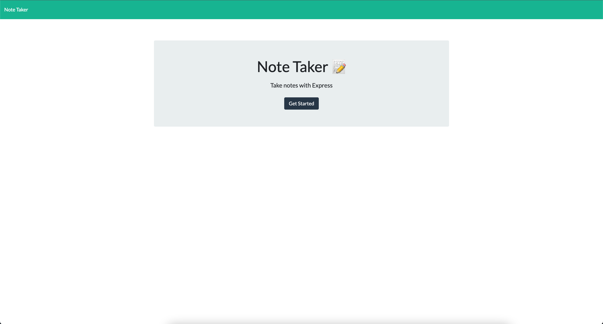
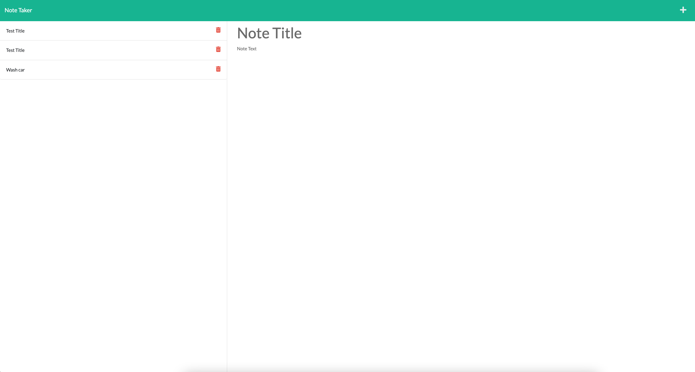

# Best Note Taking App

## Description

This app is desgined as a easy to way to take to notes. Including new notes and full descriptions

## Table of Contents

* [Installation](#installation)
* [Usage](#usage)
* [Questions](#questions)
* [Screenshot](#screenshot)
* [Deployment](#deployment)

## Installation

Clone the repothen from the root of the folder run npm install.

## Usage

Once the npm pacakages are installed enter npm start start in the command line.  The app will now be running on localhost:3001.  Enter that in the browser and you will be able to use it.

## Questions

If you have any questions please reach out to me on GitHub at [https://github.com/Emccar22](https://github.com/Emccar22) or Email me at [e.mccarthy2285@gmail.com](mailto:e.mccarthy2285@gmail.com)

## Screenshot

## Deployment

https://sleepy-mountain-04728.herokuapp.com/